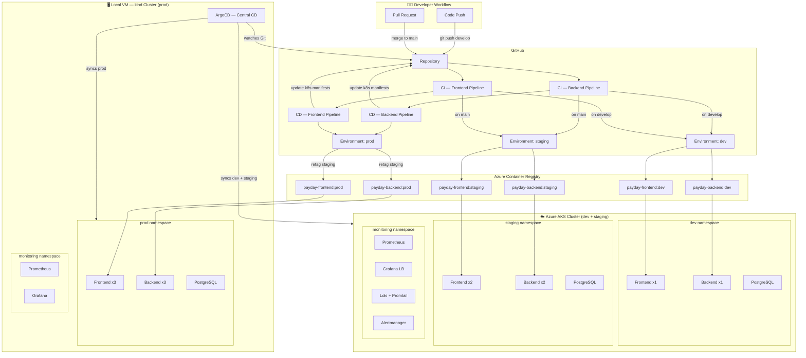
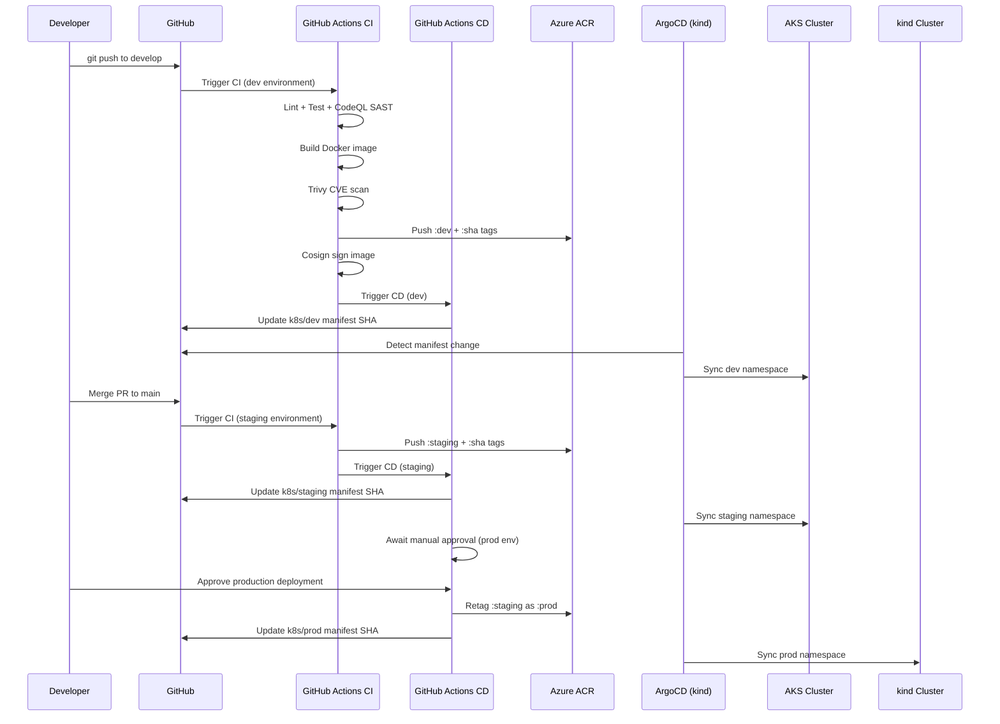
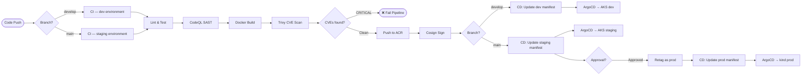

# CloudOpsHub — Automated Multi-Cluster Infrastructure Platform

> A production-grade DevOps platform built on Kubernetes, GitOps, and cloud-native observability — serving analytics dashboards across Africa and Europe.

---

## Table of Contents

- [Overview](#overview)
- [Architecture](#architecture)
- [Cluster Layout](#cluster-layout)
- [Tech Stack](#tech-stack)
- [End-to-End Flow](#end-to-end-flow)
- [CI/CD Pipeline Flow](#cicd-pipeline-flow)
- [Repository Structure](#repository-structure)
- [Quick Start](#quick-start)
- [Environment Details](#environment-details)
- [Screenshots](#screenshots)
- [Contributing](#contributing)

---

## Overview

CloudOpsHub is a SaaS analytics platform modernized with:

- **Infrastructure as Code** — Terraform provisions AKS; Ansible configures the local VM
- **Multi-cluster Kubernetes** — kind cluster (local VM) + AKS cluster (Azure)
- **GitOps Continuous Delivery** — ArgoCD installed on kind manages deployments to both clusters
- **Secure CI/CD** — GitHub Actions with OIDC auth, Trivy scanning, Cosign image signing
- **Full Observability** — Prometheus + Grafana + Loki + Alertmanager on both clusters

---

## Architecture



---

## Cluster Layout

| Environment | Cluster | Namespace | Replicas | Notes |
|---|---|---|---|---|
| dev | AKS | dev | 1 | Auto-deploy on `develop` push |
| staging | AKS | staging | 2 | Auto-deploy on `main` push |
| prod | kind (local) | prod | 3 | Manual approval required |

> **Design decision:** dev and staging run on AKS for cloud-native testing. Prod runs on the local kind cluster to demonstrate latency differences between cloud and on-premise deployments — a key project requirement.

---

## Tech Stack

| Category | Tool | Purpose |
|---|---|---|
| IaC | Terraform | Provision AKS, resource groups, networking |
| Config Mgmt | Ansible | Configure VM, install tools, bootstrap kind |
| Containers | Docker + Kubernetes | Containerized, versioned deployments |
| Local Cluster | kind | Dev-grade Kubernetes on Ubuntu VM |
| Cloud Cluster | Azure AKS | Production-grade managed Kubernetes |
| CI | GitHub Actions | Build, test, scan, push images |
| CD / GitOps | ArgoCD | Single install manages both clusters |
| Registry | Azure ACR | Private container image registry |
| Secrets | Kubernetes Secrets + OIDC | Secrets management, no stored credentials |
| Scanning | Trivy + CodeQL | Container CVE + SAST scanning |
| Image Signing | Cosign | Keyless image signing via Sigstore |
| Metrics | Prometheus + Grafana | Cluster and app metrics, dashboards |
| Logs | Loki + Promtail | Centralized log aggregation |
| Alerts | Alertmanager | Slack/email notifications |
| Backups | Velero | Cluster state + PV backups |

---

## End-to-End Flow



---

## CI/CD Pipeline Flow



---

## Repository Structure

```
cloudopshub/
├── .github/
│   └── workflows/
│       ├── backend_pipeline_ci.yaml     # Backend CI
│       ├── backend_pipeline_cd.yaml     # Backend CD
│       ├── frontend_pipeline_ci.yaml    # Frontend CI
│       └── frontend_pipeline_cd.yaml   # Frontend CD
├── cloudopshub-terraform/
│   ├── .terraform.lock.hcl
│   ├── main.tf
│   ├── provider.tf
│   ├── variables.tf
│   ├── outputs.tf
│   └── modules/
│       ├── acr/
│       ├── aks/
│       ├── networking/
│       └── resource-group/
├── ansible/
│   ├── site.yml                         # Master playbook
│   ├── inventory.ini
│   ├── group_vars/all.yml
│   └── roles/
│       ├── docker/
│       ├── kind/
│       ├── kubectl/
│       ├── helm/
│       ├── argocd/
│       └── security/
├── k8s/
│   ├── dev/
│   │   ├── backend.yaml
│   │   ├── frontend.yaml
│   │   └── postgres.yaml
│   ├── staging/
│   │   ├── backend.yaml
│   │   ├── frontend.yaml
│   │   └── postgres.yaml
│   └── prod/
│       ├── backend.yaml
│       ├── frontend.yaml
│       └── postgres.yaml
├── src/
│   ├── backend/                         # Flask API
│   └── frontend/                        # React + Vite
└── docs/
    ├── architecture.md
    ├── runbook.md
    └── medium-article.md
```

---

## Quick Start

### Prerequisites

- Ubuntu VM (min 7GB RAM, 2 vCPUs)
- Azure account with active subscription
- Azure CLI installed and logged in
- Ansible installed on your local machine

### 1. Clone the repo

```bash
git clone https://github.com/mykaelHunter/cloudopshub.git
cd cloudopshub
```

### 2. Provision AKS with Terraform

```bash
cd cloudopshub-terraform
terraform init
terraform plan
terraform apply
az aks get-credentials --resource-group cloudopshub-rg --name cloudopshub-aks
```

### 3. Bootstrap the VM with Ansible

```bash
cd ansible
# Update inventory.ini with your VM IP and user
ansible-playbook -i inventory.ini site.yml
```

### 4. Verify both clusters

```bash
kubectl config get-contexts
kubectl get nodes --context=kind-cloudopshub-local
kubectl get nodes --context=cloudopshub-aks
```

### 5. Create ACR pull secrets

```bash
for NS in dev staging; do
  kubectl create secret docker-registry acr-secret \
    --docker-server=rapiddeploy.azurecr.io \
    --docker-username=rapiddeploy \
    --docker-password="$(az acr credential show --name rapiddeploy --query 'passwords[0].value' -o tsv)" \
    --namespace $NS --context=cloudopshub-aks
done

kubectl create secret docker-registry acr-secret \
  --docker-server=rapiddeploy.azurecr.io \
  --docker-username=rapiddeploy \
  --docker-password="$(az acr credential show --name rapiddeploy --query 'passwords[0].value' -o tsv)" \
  --namespace prod --context=kind-cloudopshub-local
```

### 6. Push code to trigger the pipeline

```bash
git checkout develop
git push origin develop  # Triggers dev deployment
```

---

## Environment Details

### GitHub Environments & Secrets

Each environment requires these secrets configured in **GitHub → Settings → Environments**:

| Secret | Description |
|---|---|
| `AZURE_CLIENT_ID` | Federated OIDC app client ID |
| `AZURE_TENANT_ID` | Azure AD tenant ID |
| `AZURE_SUBSCRIPTION_ID` | Azure subscription ID |

### ArgoCD Applications

| App | Source Path | Target Cluster | Namespace | Sync |
|---|---|---|---|---|
| cloudopshub-dev | k8s/dev | AKS | dev | Auto |
| cloudopshub-staging | k8s/staging | AKS | staging | Auto |
| cloudopshub-prod | k8s/prod | kind | prod | Manual |

---

## Contributing

1. Branch from `develop` for features
2. Open a PR to `develop` → CI runs automatically
3. Merge to `main` → deploys to staging
4. Production deploys require team lead approval in GitHub Environments

**Screenshots**

Below are repository screenshots (paths reference files added under the `screenshots/` directory):

- **Application**
    - [screenshots/01-application/01_app-login-page.png](screenshots/01-application/01_app-login-page.png)
    - [screenshots/01-application/02_app-merchant-console.png](screenshots/01-application/02_app-merchant-console.png)
    - [screenshots/01-application/03_app-api-page.png](screenshots/01-application/03_app-api-page.png)

- **Infrastructure**
    - [screenshots/02-infrastructure/01_argocd-all-apps-synced.png](screenshots/02-infrastructure/01_argocd-all-apps-synced.png)
    - [screenshots/02-infrastructure/02_kind-cluster-dev-staging-pods.png](screenshots/02-infrastructure/02_kind-cluster-dev-staging-pods.png)
    - [screenshots/02-infrastructure/03_aks-cluster-prod-pods-3-replicas.png](screenshots/02-infrastructure/03_aks-cluster-prod-pods-3-replicas.png)
    - [screenshots/02-infrastructure/04_azure-container-registry-images.png](screenshots/02-infrastructure/04_azure-container-registry-images.png)

- **CI/CD Pipelines**
    - [screenshots/03-cicd-pipelines/01_backend-ci-pipeline.png](screenshots/03-cicd-pipelines/01_backend-ci-pipeline.png)
    - [screenshots/03-cicd-pipelines/02_frontend-ci-pipeline.png](screenshots/03-cicd-pipelines/02_frontend-ci-pipeline.png)
    - [screenshots/03-cicd-pipelines/03_backend-cd-pipeline-staging.png](screenshots/03-cicd-pipelines/03_backend-cd-pipeline-staging.png)
    - [screenshots/03-cicd-pipelines/04_backend-cd-pipeline-production.png](screenshots/03-cicd-pipelines/04_backend-cd-pipeline-production.png)
    - [screenshots/03-cicd-pipelines/05_frontend-cd-pipeline-staging.png](screenshots/03-cicd-pipelines/05_frontend-cd-pipeline-staging.png)
    - [screenshots/03-cicd-pipelines/06_frontend-cd-pipeline-production.png](screenshots/03-cicd-pipelines/06_frontend-cd-pipeline-production.png)

- **Observability**
    - [screenshots/04-observability/01_grafana-prometheus-alertmanager.png](screenshots/04-observability/01_grafana-prometheus-alertmanager.png)
    - [screenshots/04-observability/02_grafana-kubernetes-api-server-slo.png](screenshots/04-observability/02_grafana-kubernetes-api-server-slo.png)
    - [screenshots/04-observability/03_grafana-argocd-namespace-cpu-usage.png](screenshots/04-observability/03_grafana-argocd-namespace-cpu-usage.png)
    - [screenshots/04-observability/04_grafana-argocd-namespace-network-bandwidth.png](screenshots/04-observability/04_grafana-argocd-namespace-network-bandwidth.png)
    - [screenshots/04-observability/05_grafana-kubelet-pods-containers.png](screenshots/04-observability/05_grafana-kubelet-pods-containers.png)
    - [screenshots/04-observability/06_grafana-kubelet-storage-operations.png](screenshots/04-observability/06_grafana-kubelet-storage-operations.png)
    - [screenshots/04-observability/07_grafana-kubelet-request-duration-memory-cpu.png](screenshots/04-observability/07_grafana-kubelet-request-duration-memory-cpu.png)
    - [screenshots/04-observability/08_alertmanager-alerts-overview.png](screenshots/04-observability/08_alertmanager-alerts-overview.png)
    - [screenshots/04-observability/09_alertmanager-alerts-expanded.png](screenshots/04-observability/09_alertmanager-alerts-expanded.png)
    - [screenshots/04-observability/10_alertmanager-alerts-filtered-namespace.png](screenshots/04-observability/10_alertmanager-alerts-filtered-namespace.png)
    - [screenshots/04-observability/11_alertmanager-status.png](screenshots/04-observability/11_alertmanager-status.png)
    - [screenshots/04-observability/12_alertmanager-status-details.png](screenshots/04-observability/12_alertmanager-status-details.png)
    - [screenshots/04-observability/13_alertmanager-slack-alerts-kube-scheduler-down.png](screenshots/04-observability/13_alertmanager-slack-alerts-kube-scheduler-down.png)
    - [screenshots/04-observability/14_alertmanager-slack-alerts-kube-proxy-down.png](screenshots/04-observability/14_alertmanager-slack-alerts-kube-proxy-down.png)
